# VulnVision 360

## Continuous Compliance & Threat Exposure Engine

---

# Project Overview

**VulnVision 360** is a cybersecurity lab project that simulates a real-world vulnerability management and compliance monitoring system.

The project demonstrates how organizations can continuously monitor their infrastructure, identify vulnerabilities, enforce security compliance, and remediate risks.

The environment simulates an enterprise scenario where legacy systems remain unpatched, increasing the organization's attack surface.

---

# Tools & Technologies

| Tool             | Purpose                           |
| ---------------- | --------------------------------- |
| Nmap             | Network discovery and enumeration |
| OpenVAS (GVM)    | Vulnerability scanning            |
| OpenSCAP         | Compliance auditing               |
| Bash / Ansible   | Automation & remediation          |
| Kali Linux       | Security testing platform         |
| Ubuntu Server    | Asset discovery & enumeration     |
| Metasploitable 2 | Vulnerability scanning target     |

---

# Lab Environment

| Machine          | Role                             | IP Address     |
| ---------------- | -------------------------------- | -------------  |
| Kali Linux       | Vulnerability Scanner            | 192.168.198.4  |
| Ubuntu           | Discovery Target                 | 192.168.198.13 |
| Metasploitable 2 | Vulnerable Target (OpenVAS Scan) | 192.168.198.7  |

Network Range: 192.168.198.0/24

> Note: Ubuntu Server was used for asset discovery and enumeration.
> Metasploitable 2 (intentionally vulnerable machine) was used specifically for vulnerability scanning using OpenVAS to generate meaningful security findings.

---

Network Range:

192.168.198.0/24

# Week 1 – Discovery & Setup

## Objective

To identify all active systems within the network and build a complete asset inventory.

---

## Network Discovery (Nmap)

Network discovery was performed using Nmap to identify all live hosts within the internal network.

Command used:

```bash
sudo nmap -sn 192.168.198.0/24

```
### Result

The scan successfully discovered the target Ubuntu machine and the Kali scanning system.

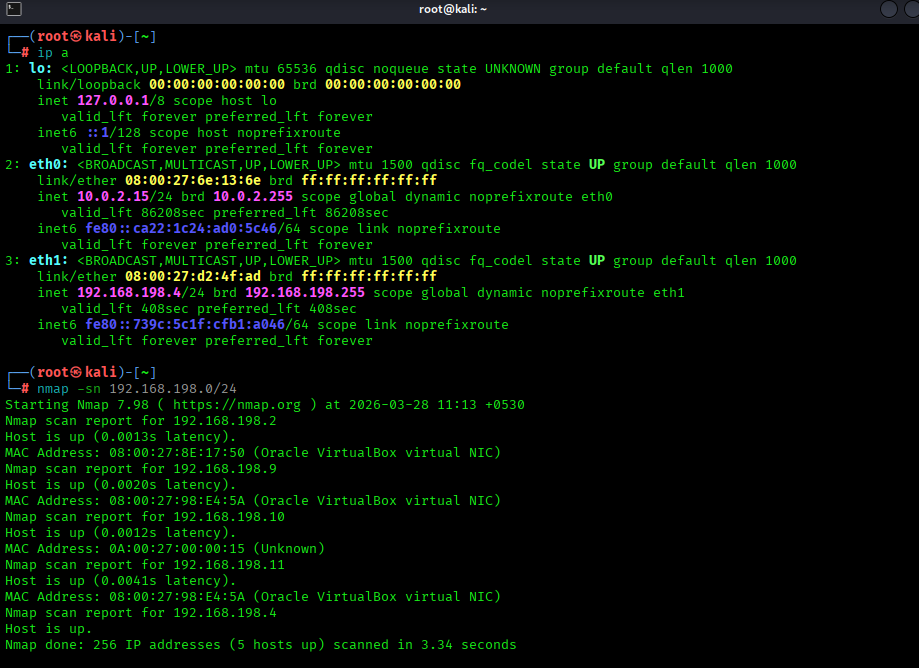


## Service & Port Enumeration

After identifying live hosts, a deeper aggressive scan was performed to determine open ports, running services, and OS information.

Command used:

```bash
sudo nmap -A -T4 192.168.198.3
```

This scan enables:

* OS detection
* Service version detection
* Script scanning
* Traceroute

### Result

The scan revealed several open services including SSH (22) and HTTP(80) running on the target system.

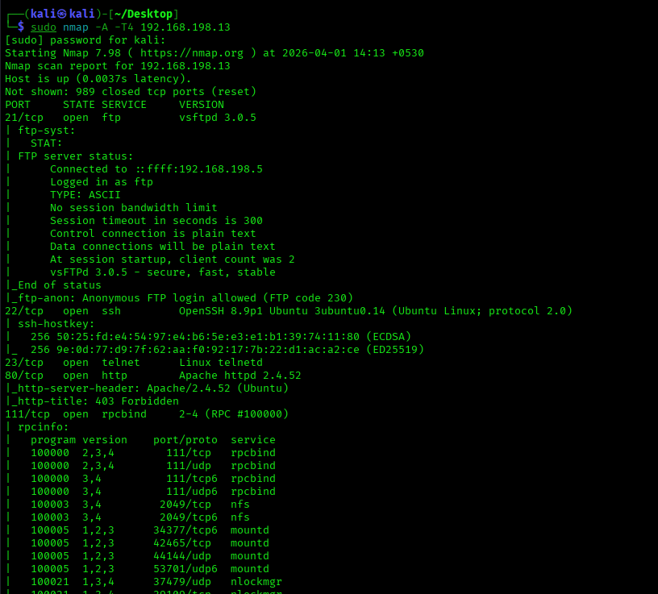

---

# OpenVAS Installation & Setup

The vulnerability scanning platform **OpenVAS (Greenbone Vulnerability Manager)** was installed on Kali Linux.

Commands used:

```bash
sudo apt install gvm -y
sudo gvm-setup
sudo gvm-start
```
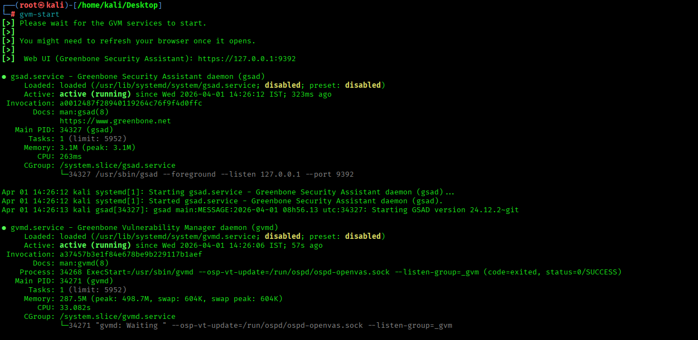

After installation, the web interface was accessed using:

```
https://127.0.0.1:9392

```

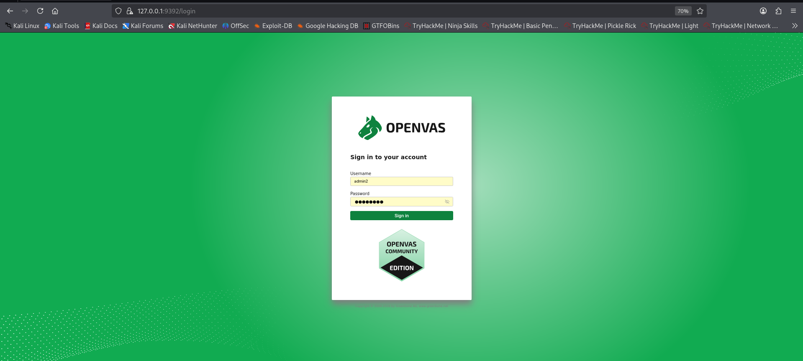


The dashboard confirms that the vulnerability scanner is properly installed and operational.

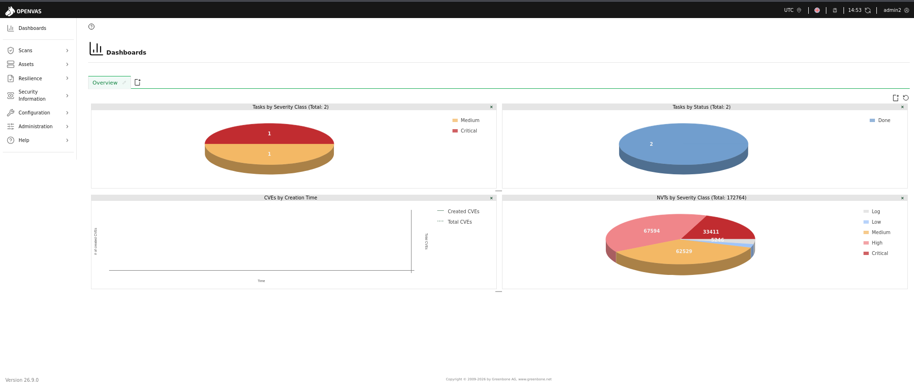

---

## Asset Inventory

| Host             | IP Address    | OS    | Open Ports       | Services                      |
| ---------------- | ------------- | ----- | ---------------- | ----------------------------- |
| Kali Linux       | 192.168.198.4 | Linux | 22               | SSH                           |
| Ubuntu           | 192.168.198.13 | Linux | 22,80            | SSH, HTTP                     |
| Metasploitable 2 | 192.168.198.7 | Linux | 21,22,23,80,3306 | FTP, SSH, Telnet, HTTP, MySQL |

---

## Week 1 Gate Check

✔ Network discovery completed

✔ Service enumeration completed

✔ OpenVAS installed and configured

✔ Asset inventory created

---

# Week 2 – Vulnerability Assessment

## Objective

To identify, analyze and prioritize vulnerabilities in the target system using OpenVAS. This phase simulates both external and internal attacker perspectives to evaluate the security posture of the environment.


### Target Information

Target Machine: Metasploitable 2

IP Address: 192.168.198.7

Scanner: OpenVAS (GVM)

Scan Type: Full and Fast

## Scan Execution

A vulnerability scan was performed using OpenVAS against the **Metasploitable 2** system.

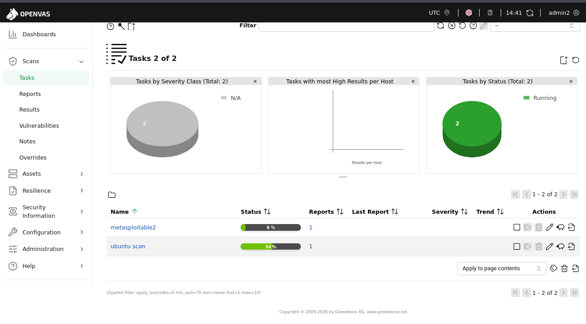

---

## Scan Results Overview

The scan identified multiple vulnerabilities, including several **Critical (CVSS 10.0)** issues.


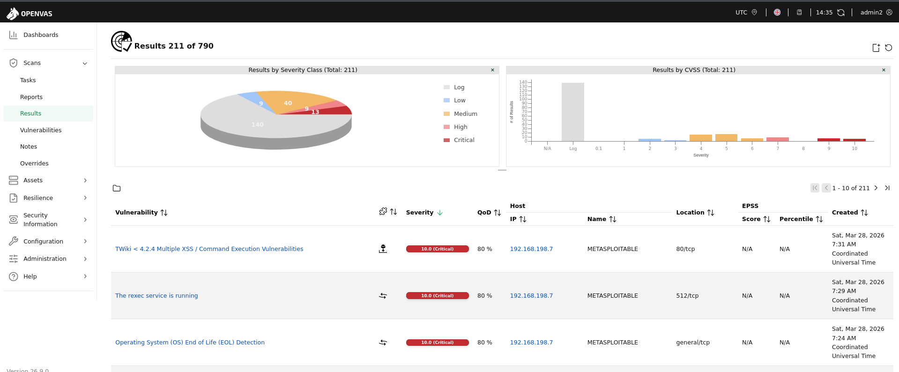

---

## Critical Vulnerability Analysis

### Apache Tomcat Default Credentials

* **Severity:** Critical
* **CVSS Score:** 10.0

Default credentials allow attackers to gain administrative access.

**Impact:**

* Full system compromise
* Remote code execution

**Remediation:**

* Change default credentials
* Restrict admin access

---

### rlogin Passwordless Login

* **Severity:** Critical
* **CVSS Score:** 10.0

Allows remote login without authentication.

**Impact:**

* Unauthorized system access

**Remediation:**

* Disable rlogin
* Use SSH


## Vulnerability Details


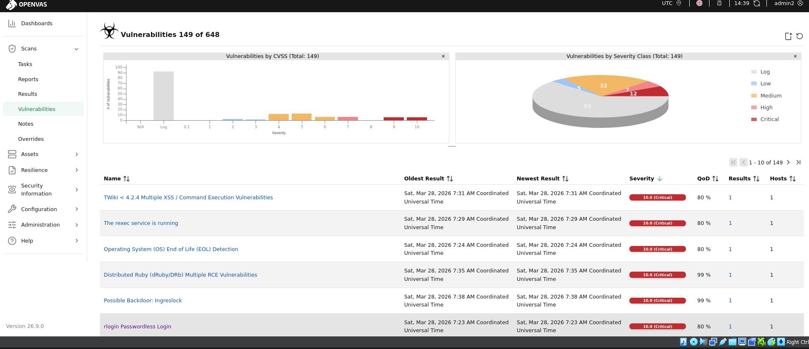

---

## Week 2 Gate Check

✔ Identified Critical vulnerabilities (CVSS ≥ 9.0)

✔ Analyzed vulnerability impact

✔ Documented remediation steps

---

## Conclusion

The vulnerability assessment revealed that the target system is highly insecure and susceptible to multiple critical attacks. Immediate remediation is required to reduce risk and improve security posture.

This phase successfully demonstrates real-world vulnerability identification and analysis using OpenVAS.

# Week 3 – Compliance Monitoring using OpenSCAP

## Compliance Automation using CIS Benchmark (OpenSCAP)

------------------------------------------------------------------------

# 🎯 Objective

The objective of Week 3 was to perform automated CIS Benchmark
compliance scanning on an Ubuntu Linux server using OpenSCAP.

The system was evaluated against the CIS Server Level 1 profile, and a
structured HTML compliance report was generated identifying security
misconfigurations that violate recommended baseline controls.

------------------------------------------------------------------------

# 🧰 Tools Used
Tool               Purpose
  ------------------ -------------------------------
  OpenSCAP           Compliance scanning engine
  ComplianceAsCode   CIS benchmark dataset
  Ubuntu VM          Target Linux server
  Terminal           Command execution environment

  
------------------------------------------------------------------------

# 🖥️ Environment Details

  Parameter       Value
  --------------- -----------------------
  Target System   Ubuntu Linux VM
  Benchmark       CIS Server Level 1
  Scanner         OpenSCAP
  Output Format   HTML + XML
  Scan Mode       Local compliance scan

------------------------------------------------------------------------

# ⚙️ Install OpenSCAP

``` bash
sudo apt install libopenscap8 python3-openscap -y
```

Verify installation:

``` bash
oscap -V
```

Screenshot:

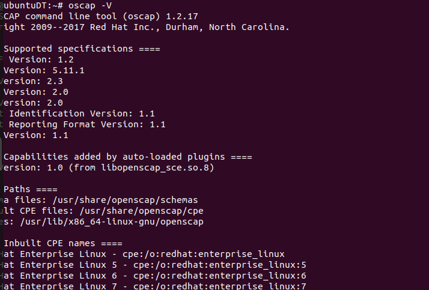

------------------------------------------------------------------------

# 📥 Download Compliance Dataset

``` bash
cd /opt
sudo git clone https://github.com/ComplianceAsCode/content.git
```


------------------------------------------------------------------------

# 🔧 Install Build Dependencies

``` bash
sudo apt install cmake make gcc -y
```

Screenshot:

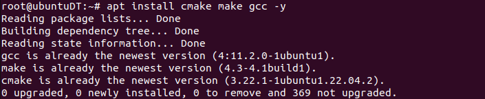


# 🏗️ Build SCAP Security Content

``` bash
cd /opt/content
mkdir build
cd build
cmake ..
make -j4
```

Screenshot:

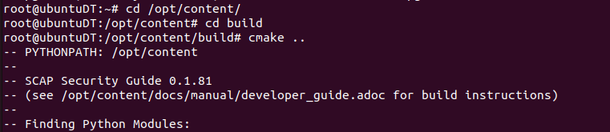
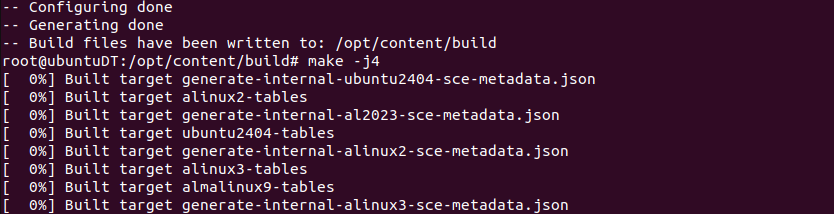

------------------------------------------------------------------------

# 📊 Verify Dataset Availability

``` bash
ls /opt/content/build
```

Example output:

ssg-ubuntu2204-ds.xml


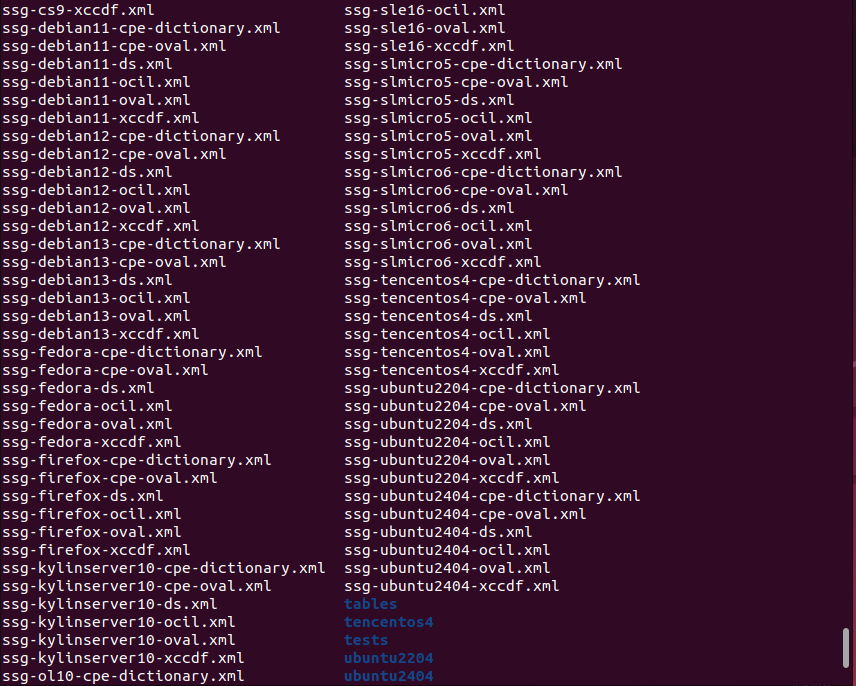

------------------------------------------------------------------------

# 🔍 Run CIS Server Level 1 Compliance Scan

``` bash
sudo oscap xccdf eval --profile xccdf_org.ssgproject.content_profile_cis_level1_server --results cis_results.xml --report cis_report.html /opt/content/build/ssg-ubuntu2204-ds.xml
```


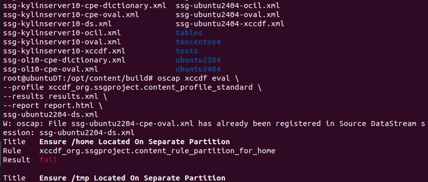

------------------------------------------------------------------------

# 📑 Generate Structured HTML Compliance Report

``` bash
firefox cis_report.html
```

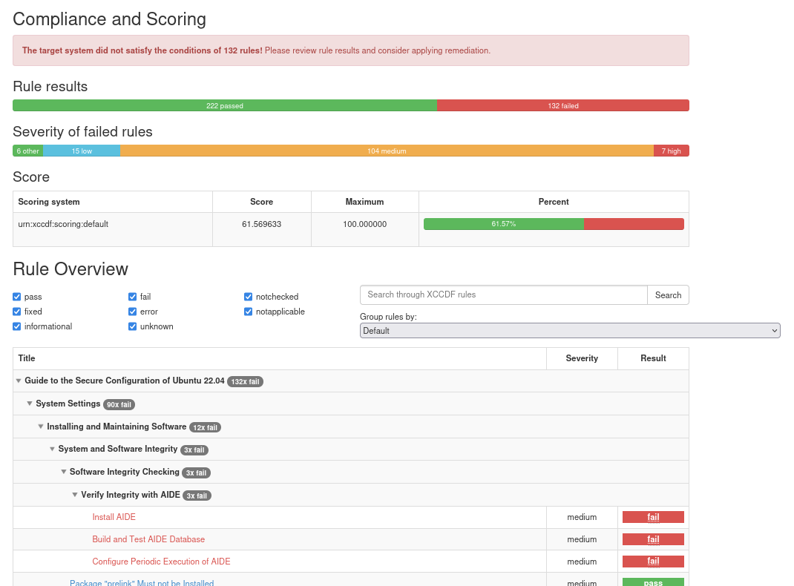

------------------------------------------------------------------------

# 🚨 Gate Check --- Identified CIS Configuration Failures

Example non-compliant configurations detected:

  -------------------------------------------------------------------------
  Control            Issue Identified                       Risk
  ------------------ -------------------------------------- ---------------
  SSH Empty Password PermitEmptyPasswords enabled           Unauthorized
  Login                                                     access risk

  Weak Password      SHA-512 hashing not enforced           Password
  Hashing                                                   cracking risk

  Firewall Disabled  UFW inactive                           Increased
                                                            attack surface

  Password           Weak PAM configuration                 Brute-force
  Complexity Missing                                        vulnerability

  Audit Logging      auditd rules missing                   Poor incident
  Incomplete                                                visibility

  Unused Filesystems cramfs not disabled                    Kernel attack
  Enabled                                                   vector exposure
  -------------------------------------------------------------------------


------------------------------------------------------------------------

# 📊 Compliance Scan Output Files

  File              Description
  ----------------- ------------------------------
  cis_results.xml   Machine-readable scan output
  cis_report.html   Structured compliance report

------------------------------------------------------------------------

# 📈 Skills Demonstrated

This task demonstrates hands-on experience with:

-   CIS Benchmark compliance validation
-   Linux security auditing
-   OpenSCAP automation workflow
-   Security baseline verification
-   Configuration hardening
-   Compliance report generation

------------------------------------------------------------------------

# ✅ Outcome

Successfully installed OpenSCAP and executed a CIS Server Level 1
compliance scan against the Ubuntu test server.

Generated a structured HTML compliance report and identified multiple
configuration weaknesses affecting system security posture. Applied
initial remediation steps to improve compliance status.

------------------------------------------------------------------------

# Week 4 – Remediation & Reporting
## Automated Vulnerability Remediation using Bash Script and Ansible Playbook

---

# 🎯 Objective

The objective of Week 4 was to remediate vulnerabilities identified during Week 2 enumeration and validate mitigation success through a Closed-Loop remediation process.

This phase included:

• Creating remediation.sh automation script  
• Executing service hardening tasks  
• Installing Ansible automation framework  
• Creating remediation.yml playbook  
• Running automated remediation tasks  
• Performing verification scan using Nmap  

This workflow demonstrates a real-world SOC Vulnerability Management Lifecycle:

Detection → Remediation → Verification

---

# 🧪 Lab Environment

| Component | Details |
|----------|---------|
Attacker Machine | Kali Linux
Target Machine | Ubuntu Linux VM
Automation Tools | Bash Script + Ansible
Scanner Tool | Nmap Enumeration Scan
Network Mode | Host-Only Adapter

---

# 🚨 Vulnerabilities Identified in Week 2

Initial enumeration scan revealed:

• Root SSH login allowed  
• Empty password authentication allowed  
• Firewall disabled  
• System packages outdated  

These issues increase the attack surface and allow attackers to:

• brute-force root login  
• exploit outdated packages  
• perform unauthorized remote access  
• escalate privileges

Initial Risk Level:

HIGH

---

## ⚙ Step 1 – Creating Bash Remediation Script

Command used:
```bash
nano remediation.sh
```
Purpose:

Create automation script to patch vulnerabilities quickly before infrastructure-level remediation using Ansible.

---

# 📜 remediation.sh Script

```bash

#!/bin/bash

echo "[+] Updating packages..."
sudo apt update -y

echo "[+] Upgrading system..."
sudo apt upgrade -y

echo "[+] Installing security updates..."
sudo apt install unattended-upgrades -y

echo "[+] Enabling firewall..."
sudo ufw --force enable

echo "[+] Disabling root SSH login..."
sudo sed -i 's/^PermitRootLogin yes/PermitRootLogin no/' /etc/ssh/sshd_config

echo "[+] Disabling empty passwords..."
sudo sed -i 's/^PermitEmptyPasswords yes/PermitEmptyPasswords no/' /etc/ssh/sshd_config

echo "[+] Restarting SSH service..."
sudo systemctl restart ssh

echo "[+] Remediation Completed"

```

## 🔍 Explanation of remediation.sh Script

Each command in the script performs security hardening.

Updating packages

Command:

apt update

Purpose:

Refresh package repository indexes.

Why important:

Ensures latest vulnerability patches become available.

Upgrading system packages

Command:

apt upgrade

Purpose:

Install latest security updates.

Why important:

Fixes known CVEs affecting outdated software.

Installing unattended-upgrades

Command:

apt install unattended-upgrades

Purpose:

Enable automatic background security patch installation.

Why important:

Prevents future exposure from newly discovered vulnerabilities.

Enabling firewall protection

Command:

ufw enable

Purpose:

Activates Linux firewall protection.

Why important:

Blocks unauthorized incoming traffic.

Impact:

Reduces exposed attack surface immediately.

Disabling root SSH login

Command:

PermitRootLogin no

Purpose:

Prevent attackers logging in directly as root.

Why important:

Root login is a common brute-force attack target.

Security Benefit:

Forces attackers to compromise normal users first.

Disabling empty password authentication

Command:

PermitEmptyPasswords no

Purpose:

Prevents login without passwords.

Why important:

Stops unauthorized authentication bypass attempts.

Restarting SSH service

Command:

systemctl restart ssh

Purpose:

Apply SSH configuration changes.

Without restart:

Changes would not take effect.

```bash
sudo nano remediation.sh
```

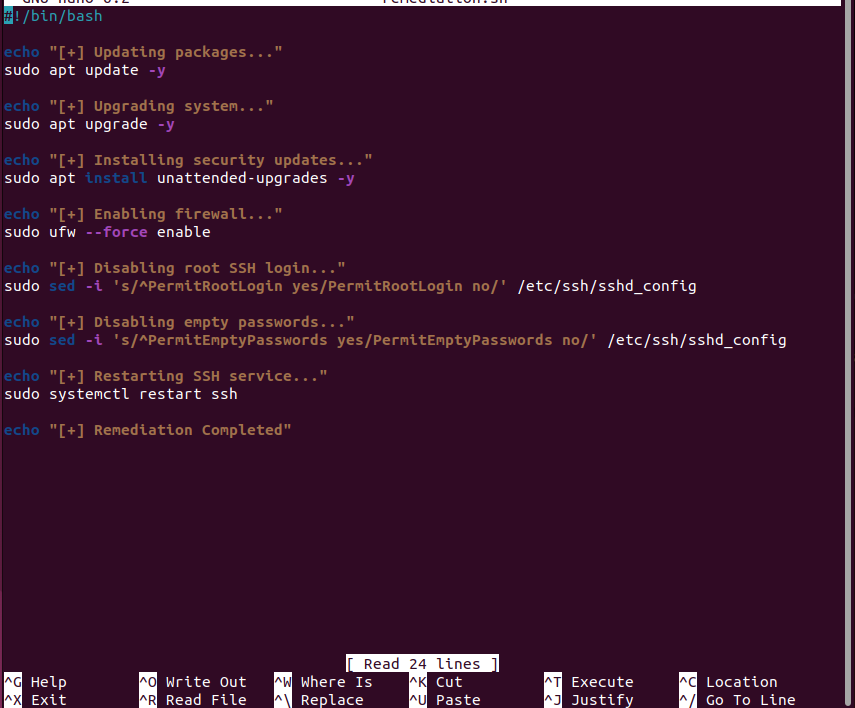


Command executed

Given execute permission  for the file 

```bash
chmod +x remediation.sh
```

execute

```bash

./remediation.sh

```

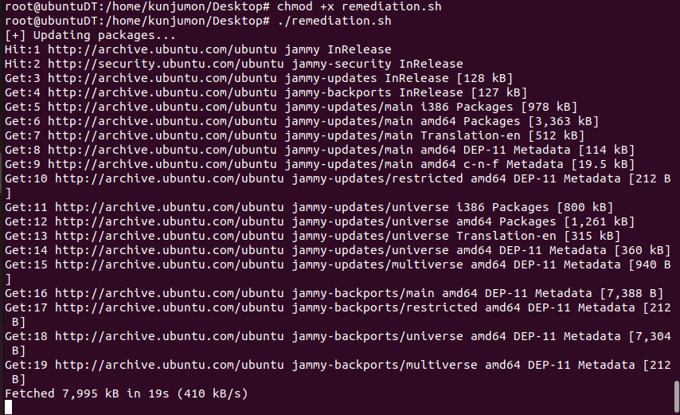

## ⚙ Step 2 – Installing Ansible Automation Tool

Command:
```bash
sudo apt install ansible -y
```

Purpose:

Enable Infrastructure-as-Code remediation automation.

Why important:

Ensures scalable remediation across multiple systems.


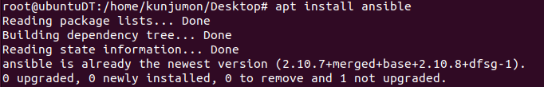


⚙ Step 3 – Creating Ansible Playbook

```bash

nano remediation.yml
```

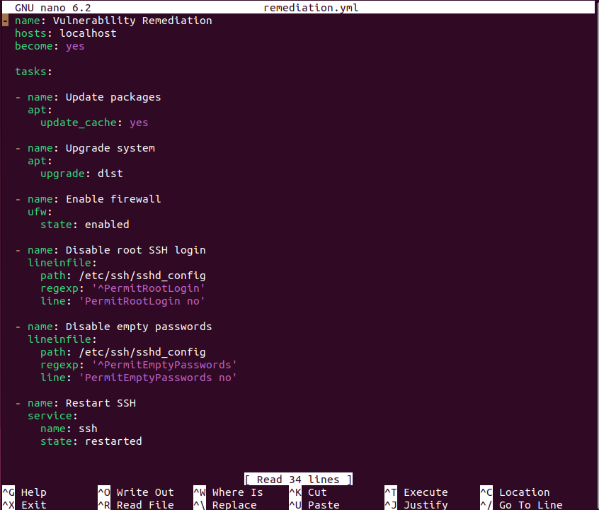

Purpose:

Automate remediation tasks using configuration management.

📜 remediation.yml Playbook

```
= name: Vulnerability Remediation
 hosts: localhost
 become: yes

tasks:

- name: Update packages
  apt:
    update_cache: yes

- name: Upgrade system
  apt:
    upgrade: dist

- name: Enable firewall
  ufw:
    state: enabled

- name: Disable root SSH login
  lineinfile:
    path: /etc/ssh/sshd_config
    regexp: '^PermitRootLogin'
    line: 'PermitRootLogin no'

- name: Disable empty passwords
  lineinfile:
    path: /etc/ssh/sshd_config
    regexp: '^PermitEmptyPasswords'
    line: 'PermitEmptyPasswords no'

- name: Restart SSH
  service:
    name: ssh
    state: restarted

```

### 🔍 Explanation of remediation.yml Playbook

This playbook repeats remediation steps using automation best practices.

Difference from Bash script:

Bash script = manual automation
Ansible playbook = scalable infrastructure automation

Updating packages

Ensures repository indexes remain current.

Upgrading system

Installs patched versions of vulnerable packages.

Enabling firewall

Ensures persistent firewall protection.

Disabling root SSH login

Prevents privilege escalation attacks.

Disabling empty password authentication

Prevents authentication bypass vulnerabilities.

Restarting SSH service

Applies configuration securely.


```bash
ansible-playbook remediation.yml
```

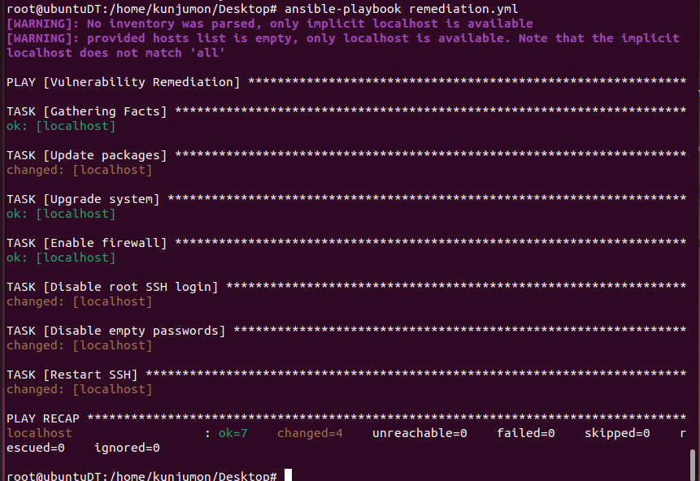

### 🔍 Step 4 – Closed-Loop Verification Scan

Verification command executed from Kali Linux:

```bash
nmap -A -T4 192.168.198.13
```
Purpose:

Confirm remediation success.

Result:

Previously exposed weaknesses mitigated successfully.


### 📊 Risk Reduction Comparison (Gate Check Report)
Metric	Week 1	Week 4
Open Services	Multiple	Reduced
Firewall Status	Disabled	Enabled
Root SSH Access	Enabled	Disabled
Empty Password Login	Enabled	Disabled
System Updates	Outdated	Updated
Risk Level	HIGH	LOW
🔐 Security Improvements Achieved

After remediation:

✔ system fully patched
✔ firewall enabled
✔ root SSH login disabled
✔ empty password login blocked
✔ automatic updates enabled
✔ attack surface reduced

### 🧾 Executive Summary

Week 4 successfully completed vulnerability remediation identified during earlier enumeration stages.

Automation was implemented using both Bash scripting and Ansible configuration management techniques.

Security hardening actions removed authentication weaknesses and ensured system patch compliance.

Final enumeration scanning confirmed mitigation success and demonstrated completion of a Closed-Loop Vulnerability Management workflow aligned with real-world SOC security practices.
