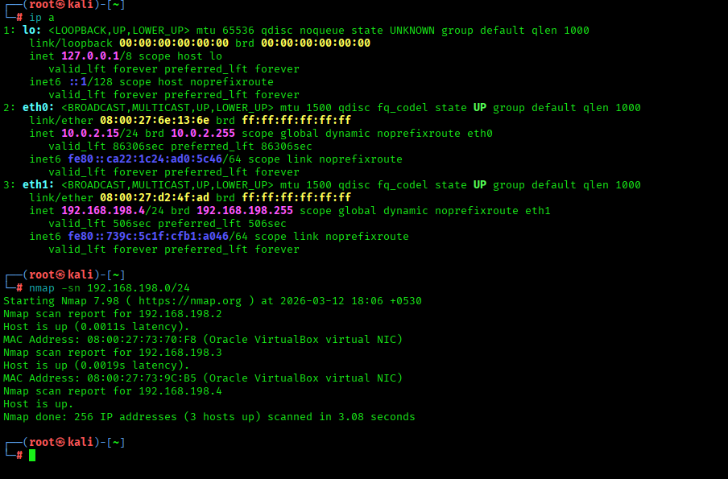

# VulnVision 360

## Continuous Compliance & Threat Exposure Engine

---

# Project Overview

**VulnVision 360** is a cybersecurity lab project designed to simulate a real-world vulnerability management and compliance monitoring system.

The project demonstrates how organizations can continuously monitor their infrastructure, identify vulnerabilities, enforce security compliance, and remediate risks.

The environment simulates an enterprise scenario where **legacy systems remain unpatched**, increasing the organization's attack surface.

---

# Tools & Technologies

| Tool           | Purpose                                 |
| -------------- | --------------------------------------- |
| Nmap           | Network discovery and asset enumeration |
| OpenVAS (GVM)  | Vulnerability scanning                  |
| OpenSCAP       | Compliance auditing                     |
| Bash / Ansible | Automated remediation                   |
| Kali Linux     | Security testing platform               |
| Ubuntu Server  | Target machine                          |

---

# Lab Environment

| Machine       | Role                  | IP Address    |
| ------------- | --------------------- | ------------- |
| Kali Linux    | Vulnerability Scanner | 192.168.198.5 |
| Ubuntu Server | Target System         | 192.168.198.3 |

Network Range:

192.168.198.0/24

---

# Week 1 – Discovery & Setup

## Objective

The goal of Week 1 is to discover all active systems within the internal network and build a complete asset inventory.

---

# Network Discovery

Network discovery was performed using **Nmap** to identify all live hosts within the internal network.

Command used:

```bash
sudo nmap -sn 192.168.198.0/24
```

This scan sends ICMP echo requests to identify active hosts.

### Result

The scan successfully discovered the target Ubuntu machine and the Kali scanning system.



---

# Service & Port Enumeration

After identifying live hosts, a deeper aggrassive scan was performed to determine open ports, running services, and OS information.

Command used:

```bash
sudo nmap -A -T4 192.168.198.3
```

This scan enables:

* OS detection
* Service version detection
* Script scanning
* Traceroute

### Result

The scan revealed several open services including SSH (23) and HTTP(80) running on the target system.


---

# OpenVAS Installation & Setup

The vulnerability scanning platform **OpenVAS (Greenbone Vulnerability Manager)** was installed on Kali Linux.

Commands used:

```bash
sudo gvm-setup
sudo gvm-start
```

After installation, the web interface was accessed using:

```
https://127.0.0.1:9392
```

The dashboard confirms that the vulnerability scanner is properly installed and operational.


---

# Asset Inventory

Based on the discovery scans, the following systems were identified in the network.

| Host          | IP Address    | Operating System | Open Ports | Services  |
| ------------- | ------------- | ---------------- | ---------- | --------- |
| Kali Linux    | 192.168.198.5 | Linux            | 22         | SSH       |
| Ubuntu Server | 192.168.198.3 | Linux            | 22,80      | SSH, HTTP |

---

# Week 1 Gate Check

The asset discovery phase successfully identified all active systems within the internal subnet.

Deliverables completed:

✔ Network asset discovery
✔ Service enumeration
✔ Vulnerability scanner installation
✔ Asset inventory documentation

This confirms **complete visibility of the attack surface in the lab environment**.

---

